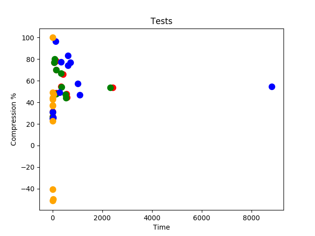

# Hybrid Text Compression
<br>

## Introduction

Hybrid Text Compression (HTC) uses different techniques to achieve maximum text compression (lossless). It makes use of LZW, Huffman, Run length encoding and Burrows Wheeler Transform to compress different types of files.

<br>

## Compression Algorithms
<br>

### LZW

It is a dictionary based technique for compressing data created by Abraham Lempel, Jacob Ziv, and Terry Welch. It is the improved version of LZ78.

<br>

### HUFFMAN Code

Huffman code is a type of prefix code which is used for lossless data compression. It was developed by David A. Huffman in 1952. It is an entropy/frequency encoding method.

<br>

### Burrows Wheeler Transform

The BWT is a block-sorting compression algorithm. It rearranges a string into runs of similar character. It was invented by Michael Burrows and David Wheeler in 1994. It is used in Bio-informics. In Next Generation Sequencing, DNA is fragmented into small pieces of which first few bases are sequenced, yielding several millions of reads each 30 to 500 base pairs(“DNA Characters”) long.

<br>

### Run Length Encoding

It is a form of lossless data compression in which runs of data are stored as a single data value and count, rather than as original run.

<br>

## Tools and Dependencies
1. C++
2. Python 2.x/3.x
3. Matplotlib C++ API
4. Boost for reading/writing binary data (in actual/raw bits)

## Compiling
&emsp; ```git clone https://github.com/IAMIQBAL/Hybrid-Text-Compression```
<br>
&emsp; ```cd Hybrid-Text-Compression```
<br>
&emsp; ```pacman -S boost```
<br>
&emsp; ```g++ -o main HybridCompressor.cpp```
<br>
&emsp; ```./main```

## Tests

We have written a test class (tests.cpp) which can be used to check the compression ratio and time taken on a scatter plot. The class uses Matplotlib’s C++ Library to plot the scatter plot. The Tests are as follows:

Note: Red = .json | Green = .txt | Blue = .xml, .html

### 1. Test for LZW
<br>


### 2. Test for Huffman
<br>


<br>

### 3. Test for RLE + LZW
<br>


### 4. Test for BWT + RLE + LZW
<br>


### 5. All Tests
<br>



<br>
<br>

### Note: 
Text, json, html and other formats data have been used for testing purposes.